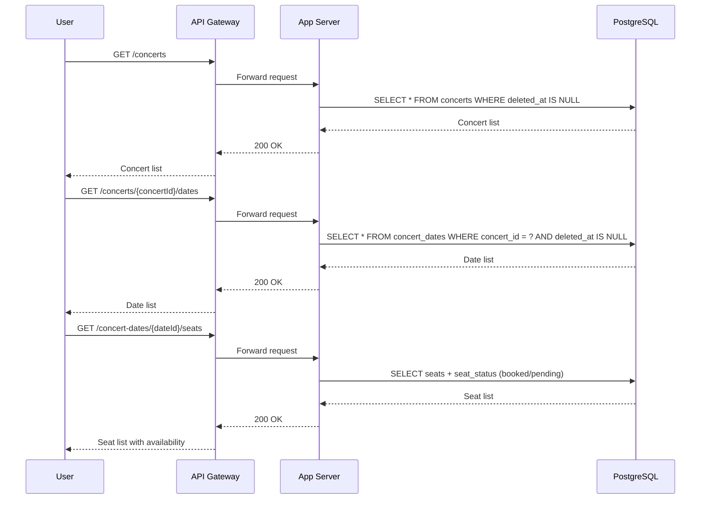
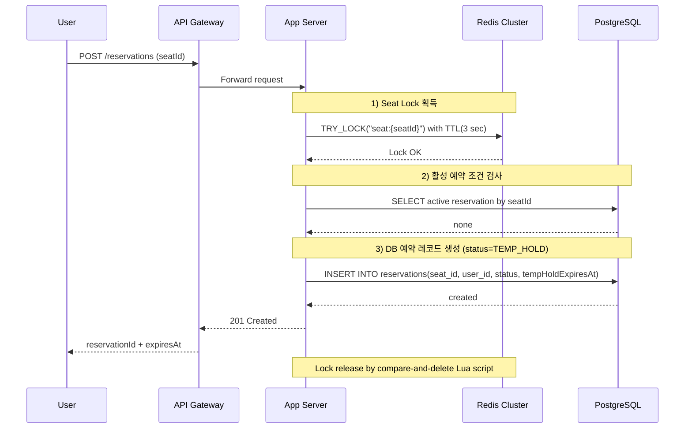
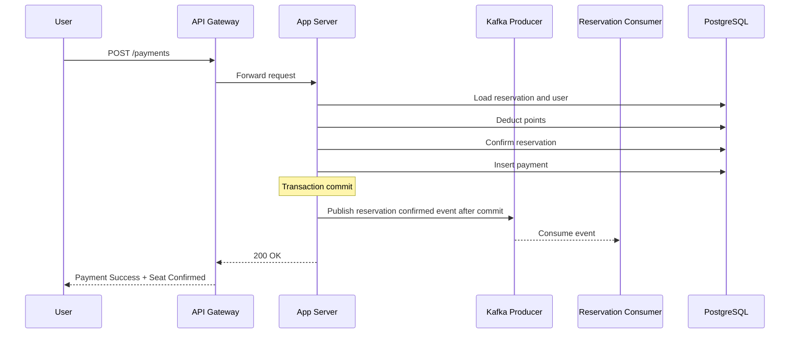
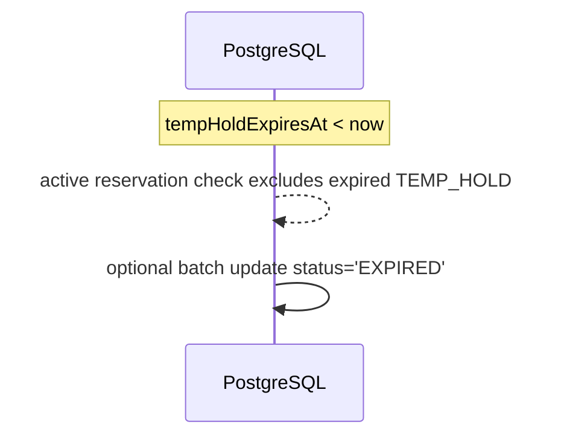
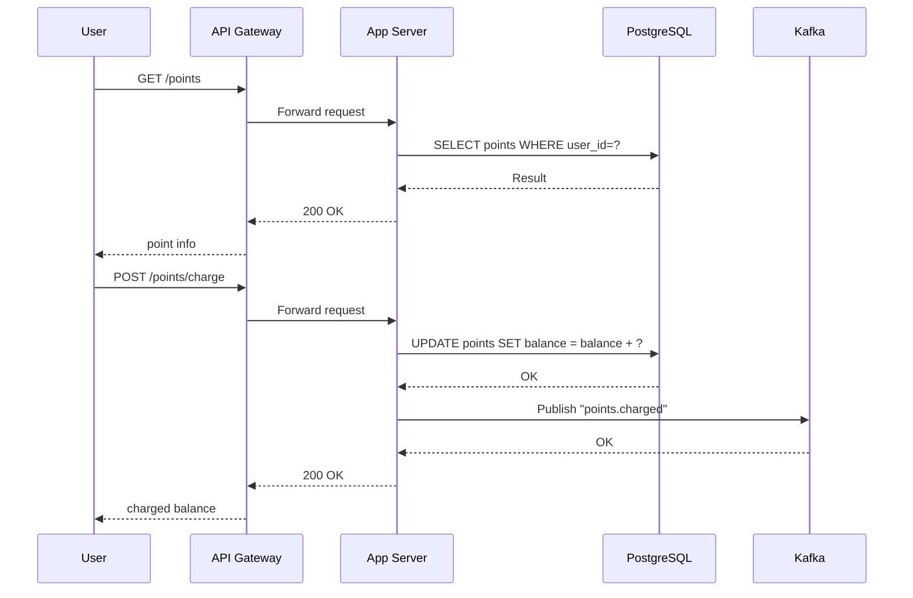
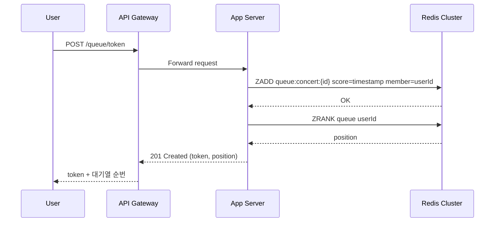
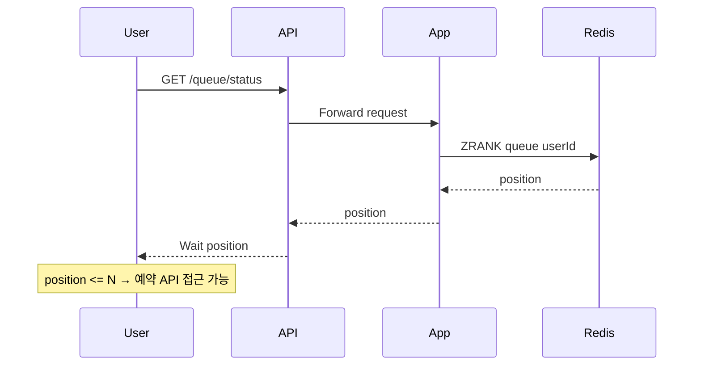
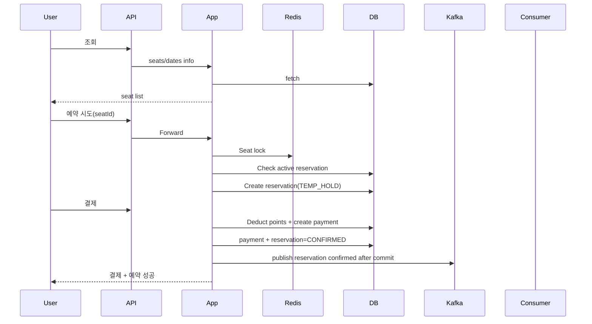

---

# 1. Overview

콘서트 예약 시스템의 핵심 비즈니스 플로우를 시퀀스 다이어그램으로 정리합니다.

---

# 2. 콘서트 조회 (콘서트 목록 → 날짜 → 좌석)

---

# 3. 좌석 예약 요청 (임시 예약: TEMP_HOLD)

좌석 충돌 방지를 위해 **Redis 분산락 + 예약 테이블의 활성 예약 조건**을 함께 사용합니다.
좌석 자체나 Redis에 임시 점유 상태를 저장하지 않고, `reservations.status`와 `tempHoldExpiresAt`으로 활성 예약 여부를 판단합니다.

---

# 4. 결제 요청 → 승인 → 예약 확정

결제는 사용자 포인트 차감, 예약 확정, 결제 생성을 하나의 트랜잭션 흐름에서 처리합니다.
예약 확정 이벤트는 트랜잭션 커밋 이후 Kafka로 전달됩니다.

---

# 5. 예약 실패 / 좌석 만료 흐름

임시 예약의 만료 여부는 `reservations.tempHoldExpiresAt`으로 판단합니다.
만료된 `TEMP_HOLD` 예약은 활성 예약 조건에서 제외되므로 새 예약을 막지 않습니다.

---

# 6. 포인트 충전 / 조회 API

---

# 7. 대기열 토큰 발급

대기열은 Redis Sorted Set 사용
(score = timestamp)
TTL 자동 만료 적용.

---

# 8. 대기열 진입 후 실제 예약 API 호출

대기열이 0에 가까워지면 티켓 구매 API 접근 허용.

---

# 9. 예약 전체 통합 플로우 (요약 종합 버전)

---
